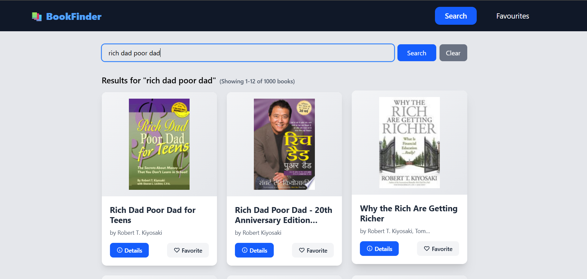
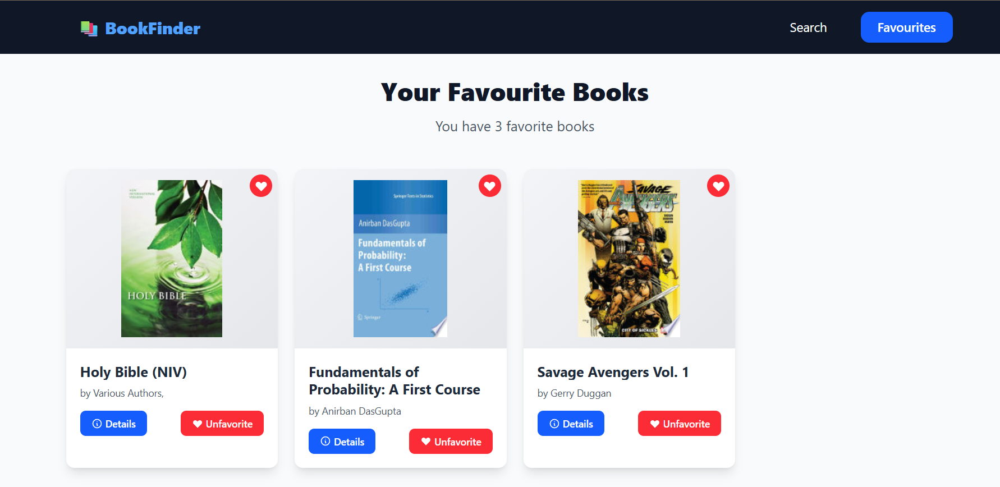

# 📚 Book Finder

A sleek and responsive web application built with **React + Vite** that allows users to search for books using a public API. Ideal for readers and book enthusiasts who want quick access to book details.

---

## 🚀 Features

- 🔍 Search books by title or author
- 📖 View book details (title, author, description, cover)
- ⚡ Fast performance with Vite
- 📱 Responsive design

---

## 🖼 Screenshots

### 🔍 Search Page


### 📖 Book Detail View


---

## 🛠️ Tech Stack

- [React](https://reactjs.org/)
- [Vite](https://vitejs.dev/)
- [JavaScript](https://developer.mozilla.org/en-US/docs/Web/JavaScript)
- [Open Library API](https://openlibrary.org/developers/api) *(or whichever API you’re using)*

---

## 📦 Installation

```bash
git clone https://github.com/guptaditya123/Book-Finder.git
cd Book-Finder
npm install
npm run dev
